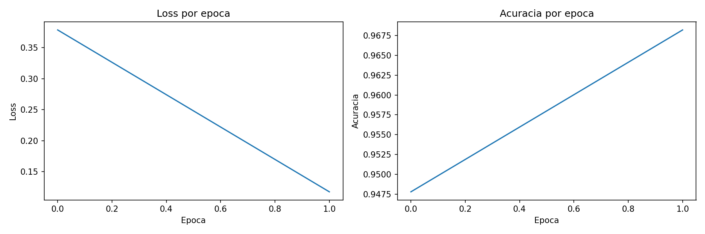

# Character recognition usando Multi Layer Perceptrons e o dataset MNIST

## Como rodar

Instala as dependencias:

```
pip install numpy matplotlib tensorflow
```

Executa o treinamento pelo notebook:

```
cd notebooks
jupyter notebook experimentos.ipynb
```

Ou direto pelo Python:

```python
from mlp.network import MLP
from tensorflow.keras.datasets import mnist
import numpy as np

(X_train, y_train), (X_test, y_test) = mnist.load_data()
X_train = X_train.reshape(-1, 784) / 255.0
X_test  = X_test.reshape(-1, 784)  / 255.0

def one_hot(y, n=10):
    out = np.zeros((len(y), n))
    out[np.arange(len(y)), y] = 1
    return out

model = MLP(lr=0.01)
model.treinar(X_train, one_hot(y_train), X_test, y_test, epocas=10)
```

## Arquitetura escolhida

A rede tem 3 camadas no total:

- Entrada: 784 neuronios (pixels da imagem 28x28 achatados)
- Camada oculta 1: 128 neuronios, ativacao ReLU
- Camada oculta 2: 128 neuronios, ativacao ReLU
- Saida: 10 neuronios, ativacao Softmax (uma probabilidade por digito)

Usei ReLU nas camadas ocultas porque ela nao satura para valores positivos, o que evita o problema de gradientes que somem durante o backprop. O Softmax na saida converte os scores brutos numa distribuicao de probabilidade onde os 10 valores somam 1, o que faz sentido para classificacao multi-classe.

128 neuronios por camada e um tamanho razoavel para MNIST: grande o suficiente para aprender as representacoes, pequeno o suficiente para treinar rapido.

### Calculos da rede principal (MNIST)


### Calculos da rede XOR


## Resultados

Curva de loss e acuracia ao longo do treinamento:



Tabela comparativa de experimentos:

| configuracao | lr | epocas | acuracia |
|---|---|---|---|
| 128-128, ReLU | 0.01 | 2 | 96.82% |
| 128-128, ReLU | 0.02 | 2 | 96.47% |
| 128-128, ReLU | 0.01 | 4 | 97.44% |

## Decisoes e dificuldades

A decisao mais dificil foi entender como o backprop funciona de verdade, nao so decorar as formulas. Levei um tempo para entender que o gradiente de cada camada vem da camada seguinte, e que a transposta aparece porque a direcao da transformacao inverte. Comecei achando que era so resolver a equacao ao contrario, mas nao e isso.

Tentei implementar o backprop do XOR calculando os deltas na ordem errada: atualizava W2 antes de usa-lo para calcular delta1. A rede ate convergiu em alguns casos, mas era um bug real que so nao apareceu porque o XOR e simples e o learning rate era pequeno. Para uma rede maior o erro teria acumulado.

Outro problema que me travou foi a falta de uma seed aleatoria. A rede funcionou na primeira tentativa, dai parei de conseguir reproduzir o resultado. Pesquisando, descobri que e comportamento normal do XOR com redes pequenas: algumas inicializacoes levam a minimos locais ruins e a rede nao converge. Resolver foi simples, mas me fez entender na pratica por que reprodutibilidade importa.

Tambem confundi bastante quando usar multiplicacao matricial (@) e quando usar multiplicacao elemento a elemento (*). Fui entendendo conforme implementei: @ e para combinar camadas (forward e backprop pelo W.T), * e para aplicar a derivada da ativacao elemento por elemento.

Se começasse do zero provavelmente teria elaborado as equações do XOR primeiro. Mas de qualquer forma ter feito ele no notebook inteiro antes do MNIST ja ajudou.