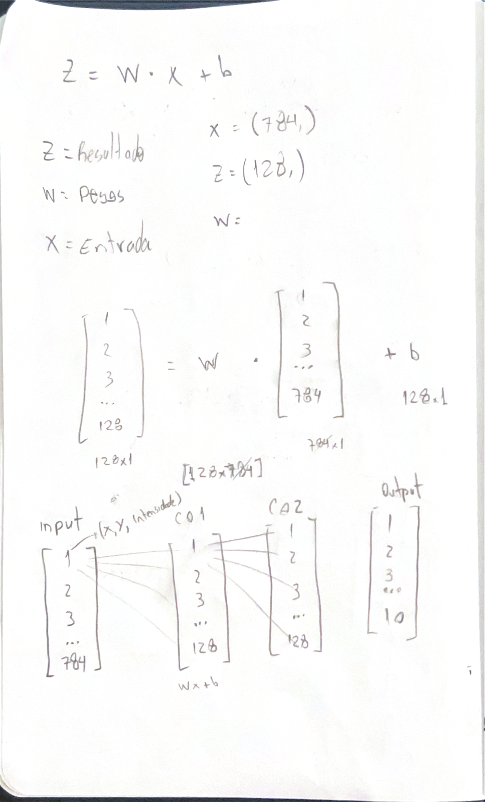
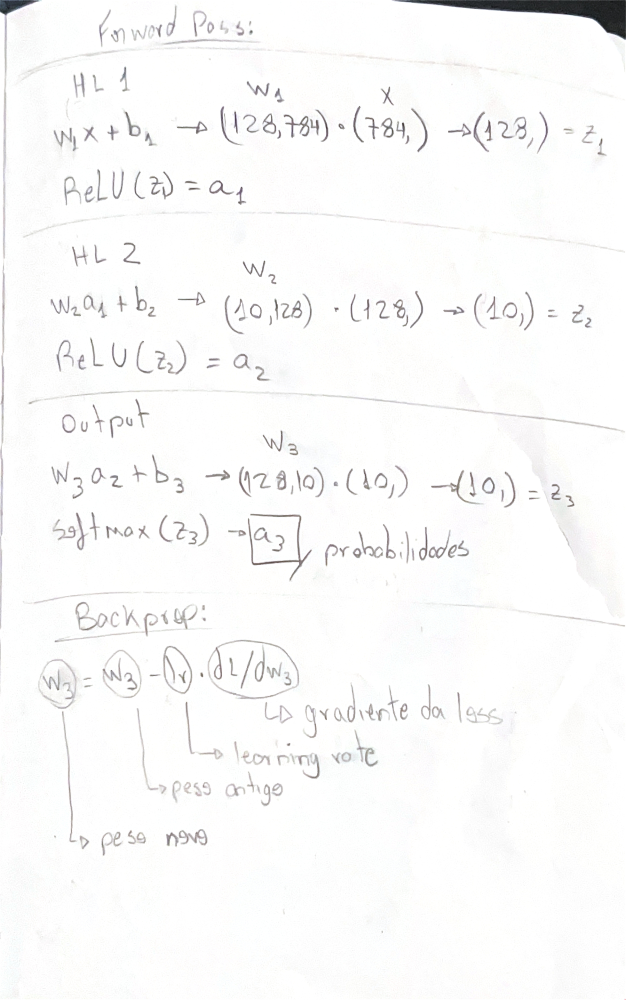
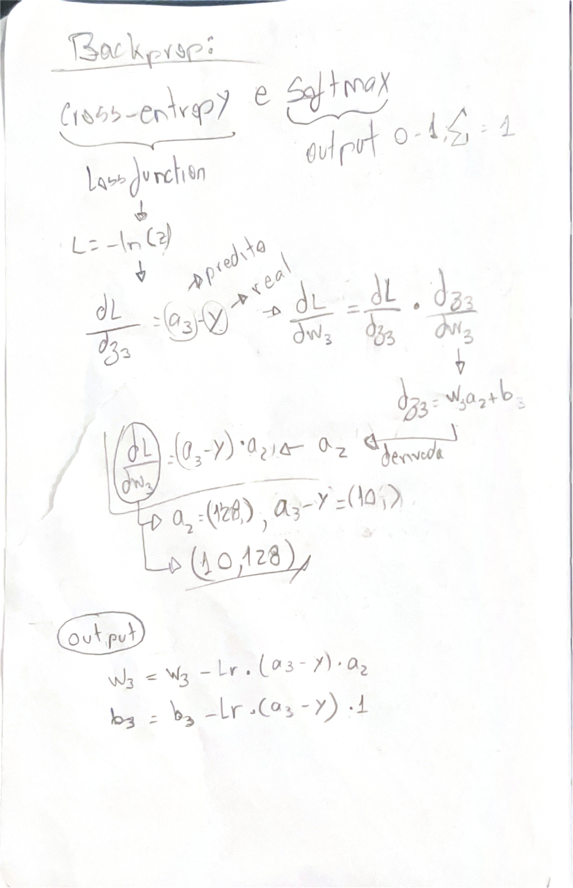
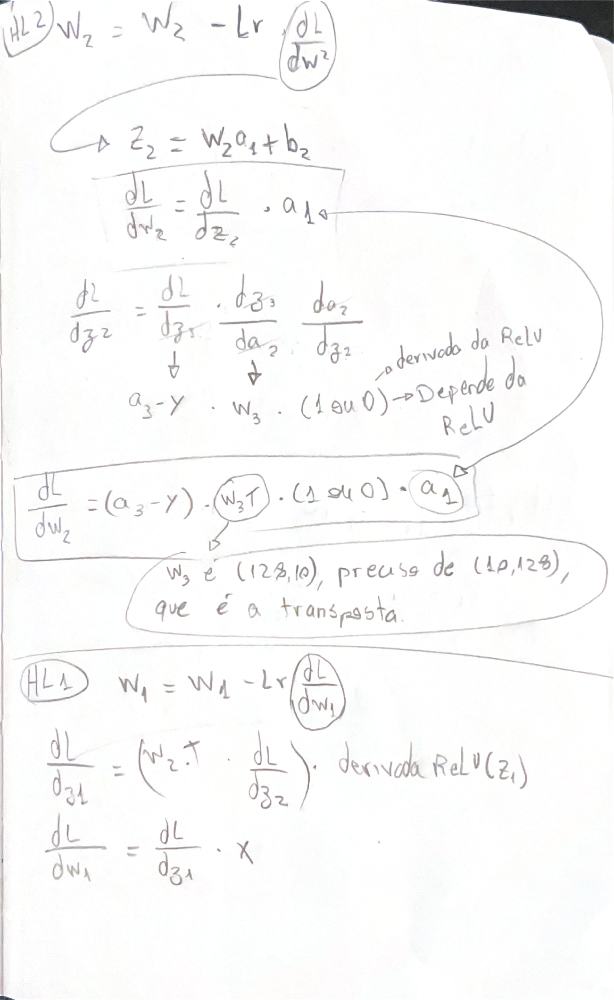
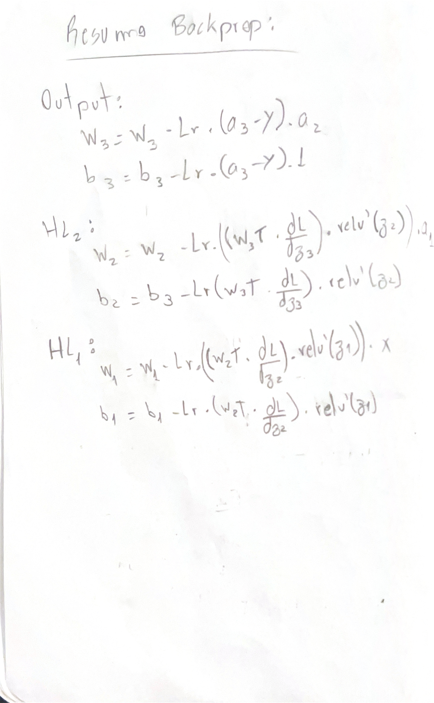
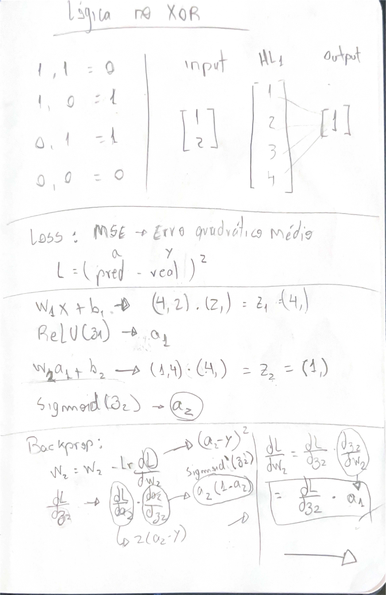
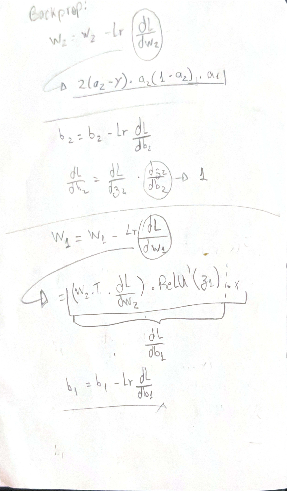
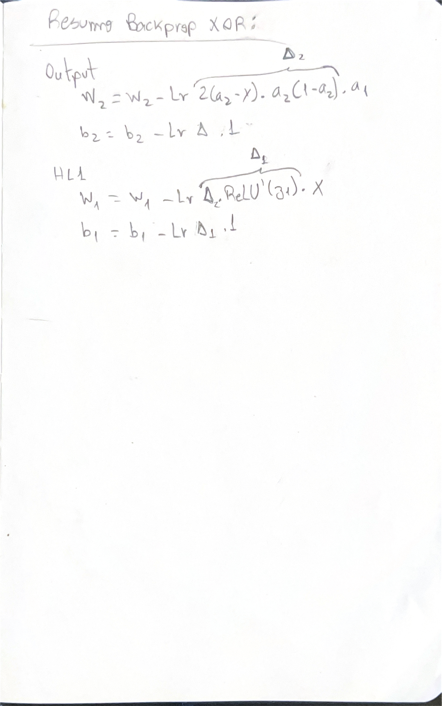

# Character recognition usando Multi Layer Perceptrons e o dataset MNIST

## Como rodar

Instala as dependências:

```
pip install numpy matplotlib tensorflow
```

Executa o treinamento pelo notebook:

```
cd notebooks
jupyter notebook experimentos.ipynb
```

Ou direto pelo Python:

```python
from mlp.network import MLP
from tensorflow.keras.datasets import mnist
import numpy as np

(X_train, y_train), (X_test, y_test) = mnist.load_data()
X_train = X_train.reshape(-1, 784) / 255.0
X_test  = X_test.reshape(-1, 784)  / 255.0

def one_hot(y, n=10):
    out = np.zeros((len(y), n))
    out[np.arange(len(y)), y] = 1
    return out

model = MLP(lr=0.01)
model.train(X_train, one_hot(y_train), epochs=10)
```

## Arquitetura escolhida

A rede tem 3 camadas no total:

- Entrada: 784 neurônios (pixels da imagem 28x28 achatados)
- Camada oculta 1: 128 neurônios, ativação ReLU
- Camada oculta 2: 128 neurônios, ativação ReLU
- Saída: 10 neurônios, ativação Softmax (uma probabilidade por dígito)

Usei ReLU nas camadas ocultas porque ela não satura para valores positivos, o que evita o problema de gradientes que somem durante o backprop. O Softmax na saída converte os scores brutos numa distribuição de probabilidade onde os 10 valores somam 1, o que faz sentido para classificação multi-classe.

128 neurônios por camada é um tamanho razoável para MNIST: grande o suficiente para aprender as representações, pequeno o suficiente para treinar rápido.

### Cálculos da rede principal (MNIST)







### Cálculos da rede XOR





## Resultados

_a preencher após treino_

Acurácia no teste: XX%

Curva de loss:

_(inserir plot)_

Tabela comparativa de experimentos:

| configuração | lr | épocas | acurácia |
|---|---|---|---|
| 128-128, ReLU | 0.01 | 10 | XX% |
| _experimento 2_ | | | |

## Decisões e dificuldades

A decisão mais difícil foi entender como o backprop funciona de verdade, não só decorar as fórmulas. Levei um tempo para entender que o gradiente de cada camada vem da camada seguinte, e que a transposta aparece porque a direção da transformação inverte. Comecei achando que era só resolver a equação ao contrário, mas não é isso.

Tentei implementar o backprop do XOR calculando os deltas na ordem errada: atualizava W2 antes de usá-lo para calcular delta1. A rede até convergiu em alguns casos, mas era um bug real que só não apareceu porque o XOR é simples e o learning rate era pequeno. Para uma rede maior o erro teria acumulado.

Outro problema que me travou foi a falta de uma seed aleatória. A rede funcionou na primeira tentativa, dai parei de conseguir reproduzir o resultado. Pesquisando, descobri que é comportamento normal do XOR com redes pequenas: algumas inicializações levam a mínimos locais ruins e a rede não converge. Resolver foi simples, mas me fez entender na prática por que reprodutibilidade importa.

Também confundi bastante quando usar multiplicação matricial (@) e quando usar multiplicação elemento a elemento (*). Fui entendendo conforme implementei: @ é para combinar camadas (forward e backprop pelo W.T), * é para aplicar a derivada da ativação elemento por elemento.

Se fosse refazer do zero, começaria pelo XOR mais cedo e com mais atenção, em vez de pular direto para o MNIST. E escreveria o README enquanto desenvolvia, não depois.
